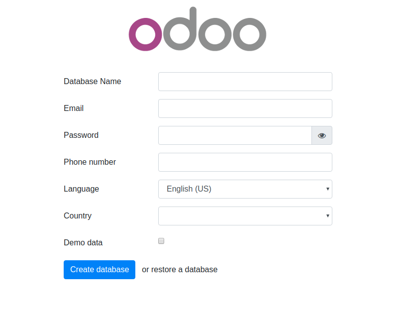
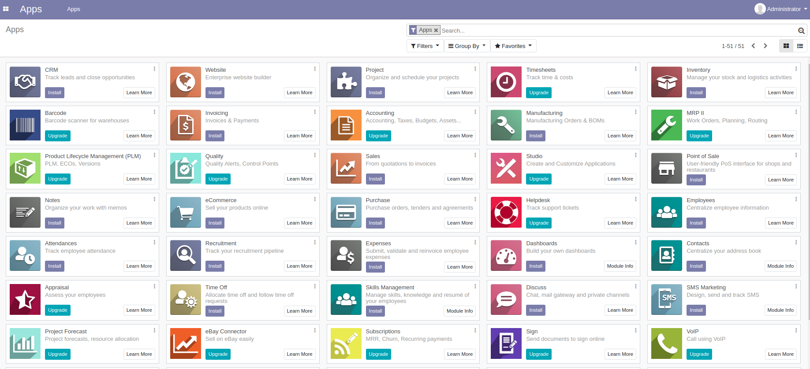
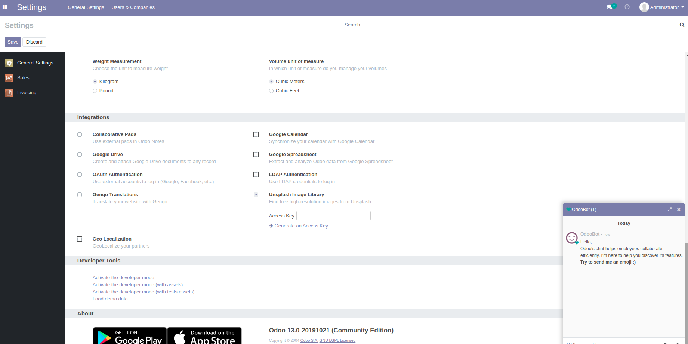

# Usage

Change the folder permission to make sure that the container is able to access the directory:
```
$ sudo chmod -R 777 addons
$ sudo chmod -R 777 etc
```

Start the container:
```
$ docker-compose up
```

* Then open `localhost:8071` to access Odoo 13.0. If you want to start the server with a different port, change **8071** to another value:

```
ports:
 - "8071:8069"
```


* Log file is printed @ **etc/odoo-server.log**

To run in detached mode, execute this command:

```
$ docker-compose up -d
```

# Custom addons

The **addons** folder contains custom addons. Just put your custom addons if you have any.

# Odoo configuration

To change Odoo configuration, edit file: **etc/odoo.conf**.

# docker-compose.yml

* odoo:latest
* postgres:11.6

# Odoo 13 screenshots





